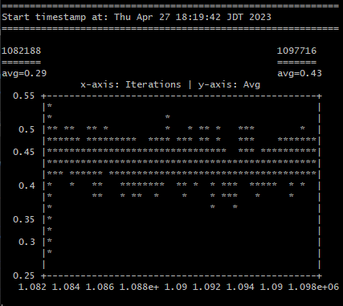

# Neurograph
Neural network graph plotter for TensorFlow training data (i.e. GPT-2)

`term_plot.py` - terminal window version -- useful for remote/headless neural model training with tensorflow



Tested on Windows Git Bash & Ubuntu Linux 22.04LTS

requirements:

`pip install termplotlib`
(termplotlib might have other dependencies)

1. assumes you have your readouts under `logs/`, fetches the latest .txt from that directory
2. prints out a neat graph into your terminal window
3. ???
4. yes

Can be run in an auto-update mode like so in i.e. bash by adding this to `~/.bash_aliases`;

```
function termplotview() {
  while true; do
    python term_plot.py
  done
}
```

# What's this for?

The script parses the training data and plots a graph using `termplotlib`. The x-axis represents the number of iterations, and the y-axis represents the average loss.

Neurograph might be an useful tool for quickly visualizing the training progress of neural networks without having to switch to a separate visualization tool or library. It is also lightweight and does not require a graphical user interface.

Using a lightweight library like `termplotlib` for plotting in the terminal window can save system resources compared to using a full-fledged plotting library like `matplotlib`. Additionally, having the graph output in the terminal window can be convenient for users who prefer to work in the command line interface or need to run their programs on headless servers without a graphical user interface.

# TODO

- Sanitize the code for the matplolib+Tk version w/ web backend and include it as a part of the `neurograph` overall
- Better data point visibility esp. for per-iteration value scatters (this is not feasible to do in a terminal due to the number of data points involved; is crucial for an overview of model integrity)

